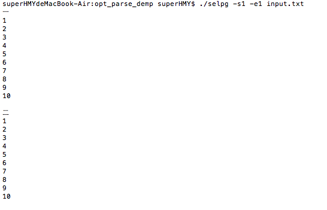
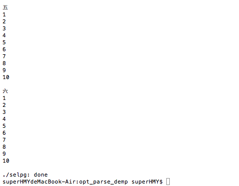
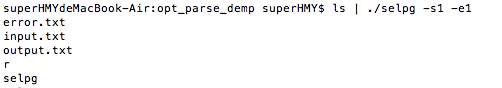
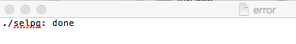

#CLI命令使用程序开发基础
##1、概述

  CLI（Command Line Interface）实用程序是Linux下应用开发的基础。正确的编写命令行程序让应用与操作系统融为一体，通过shell或script使得应用获得最大的灵活性与开发效率。Linux提供了cat、ls、copy等命令与操作系统交互；go语言提供一组实用程序完成从编码、编译、库管理、产品发布全过程支持；容器服务如docker、k8s提供了大量实用程序支撑云服务的开发、部署、监控、访问等管理任务；git、npm等都是大家比较熟悉的工具。尽管操作系统与应用系统服务可视化、图形化，但在开发领域，CLI在编程、调试、运维、管理中提供了图形化程序不可替代的灵活性与效率。

##2、selpg程序测试
###**（1）$ selpg -s1 -e1 input_file**
该命令将把“input_file”的第 1 页写至标准输出（也就是屏幕），因为这里没有重定向或管道。input.txt中有十组数字

到

###**（2）$ selpg -s1 -e2 input_file >output_file**
selpg 将第 1 页到第 2 页写至标准输出；标准输出被 shell／内核重定向至“output_file”。output.txt如下图所示：

###**（3）$ other_command | selpg -s10 -e20**
“other_command”的标准输出被 shell／内核重定向至 selpg 的标准输入。将第 10 页到第 20 页写至 selpg 的标准输出（屏幕）。

###**（4）$ selpg -s1 -e2 input_file 2>error_file**
selpg 将第 1 页到第 2 页写至标准输出（屏幕）；所有的错误消息被 shell／内核重定向至“error_file”。请注意：在“2”和“>”之间不能有空格；这是 shell 语法的一部分（请参阅“man bash”或“man sh”）。

###**（5）$ selpg -s1 -e2 input_file >output_file 2>error_file**
selpg 将第 1 页到第 2 页写至标准输出，标准输出被重定向至“output_file”；selpg 写至标准错误的所有内容都被重定向至“error_file”。当“input_file”很大时可使用这种调用；您不会想坐在那里等着 selpg 完成工作，并且您希望对输出和错误都进行保存。

其中测试得结果与上述相同。

